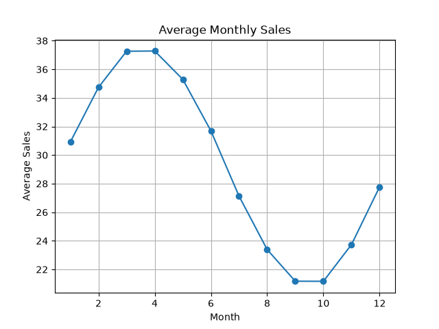

# Retail Demand Forecasting

A Machine Learning project to predict retail product sales using historical sales data, pricing, promotions, and time-based features.

The main objective of this project is to understand historical sales patterns, train regression models, evaluate their performance, and forecast future sales.

---

## 1. Project Overview

Retail businesses need to estimate future product demand to manage inventory, reduce overstocking, and avoid stock shortages.

In this project, I built a Retail Demand Forecasting model using historical retail sales data.

The project follows a complete Machine Learning workflow:

- Data loading and exploration
- Exploratory Data Analysis (EDA)
- Data preprocessing
- Feature engineering
- Time-based data splitting
- Model training
- Model comparison
- Model evaluation
- Feature importance analysis
- Future sales forecasting
- Saving the trained model using Joblib

For the current version, the model is trained on one store and one item: `store_1` and `item_1`.

---

## 2. Problem Statement

Given historical sales data and related features such as price, promotion, weekday, and previous sales, predict the sales quantity for a particular day.

This is a **Regression Problem** because the target variable, sales, is a numerical value.

---

## 3. Dataset Description

The dataset contains retail sales information with the following columns:

| Column | Description |
|---|---|
| date | Date of the sales record |
| store_id | Unique store identifier |
| item_id | Unique item identifier |
| sales | Number of units sold |
| price | Product price |
| promo | Promotion indicator |
| weekday | Day of the week |
| month | Month of the year |

The dataset contains approximately 4.56 million rows.

For this project, I selected data for `store_1` and `item_1` to focus on forecasting a single product at a single store.

---

## 4. Exploratory Data Analysis (EDA)

EDA helps us understand the data before training a model.

### Graph 1: Monthly Sales Trend



**Purpose:**

This graph shows how total sales change from month to month.

**What I analyzed:**

- Monthly changes in sales
- Possible seasonal patterns
- Periods with relatively high or low sales

**Why it matters:**

Monthly trends can reveal patterns that may be useful when creating time-based features for forecasting.

### Graph 2: Yearly Sales


**Purpose:**

This graph compares total sales across different years.

**What I analyzed:**

- Yearly sales variation
- Overall changes in sales over time
- Whether sales increased or decreased across years

**Why it matters:**

Yearly analysis gives a broader view of historical demand patterns.

---

## 5. Data Preprocessing and Feature Engineering

### Date Conversion

The `date` column was converted into a datetime format so that date-based features could be extracted.

### Time-Based Features

The following features were used:

- `year`: Represents the year of the sales record.
- `weekday`: Represents the day of the week.
- `month`: Represents the month of the year.

These features help the model learn patterns associated with time.

### Lag Features

Lag features use previous sales values as input features.

- `lag_1`: Sales from the previous day.
- `lag_7`: Sales from seven days earlier.

**Why lag features?**

Sales on a particular day may be related to sales on previous days. Lag features provide the model with information about recent sales history.

The first seven rows with unavailable lag values were removed.

---

## 6. Train, Validation, and Test Split

Since this is a time-series forecasting problem, I used a chronological split instead of random splitting.

| Dataset | Time Period | Purpose |
|---|---|---|
| Training | 2019–2021 | Train the models |
| Validation | 2022 | Compare models and select one |
| Testing | 2023 | Evaluate final model performance |

**Why chronological splitting?**

In forecasting, future data should not be used to train a model that predicts the past.

Keeping the time order helps simulate a more realistic forecasting scenario.

---

## 7. Model Training

I experimented with the following regression models:

### Linear Regression

Linear Regression learns a linear relationship between input features and the target variable.

It was used as a simple regression model for comparison.

### Decision Tree Regressor

Decision Tree learns decision rules by splitting data into different regions.

It can capture nonlinear relationships but may overfit the training data.

### Random Forest Regressor

Random Forest is an ensemble learning method that combines predictions from multiple decision trees.

It can capture nonlinear relationships and interactions among features.

### Tuned Random Forest

I also experimented with a Random Forest model using the following parameters:

- `n_estimators = 100`
- `max_depth = 10`
- `min_samples_leaf = 5`

The goal was to control model complexity and compare the result with the default Random Forest.

---

## 8. Model Comparison

### Graph 3: Validation Model Comparison


**Purpose:**

This graph compares the Mean Absolute Error (MAE) of different models on validation data.

**Validation Results:**

| Model | Validation MAE |
|---|---:|
| Linear Regression | 4.7943 |
| Decision Tree | 4.7397 |
| Random Forest | 3.6713 |
| Tuned Random Forest | 3.7444 |
| Baseline | 9.0712 |

**Observation:**

Random Forest achieved the lowest validation MAE among the tested models.

Therefore, I selected the default Random Forest for final training.

The baseline predicts sales using the previous day's sales (`lag_1`).

---

## 9. Final Model Evaluation

The selected Random Forest model was trained again using all available data before 2023 and evaluated on 2023 test data.

### Evaluation Metrics

**Mean Absolute Error (MAE)**

MAE measures the average absolute difference between actual and predicted sales.

A lower MAE indicates that predictions are closer to actual values on average.

**Root Mean Squared Error (RMSE)**

RMSE measures prediction error while giving more weight to larger errors.

A lower RMSE indicates smaller prediction errors overall, with greater sensitivity to large mistakes.

### Final Test Results

| Metric | Baseline | Random Forest |
|---|---:|---:|
| MAE | 9.5041 | 3.5126 |
| RMSE | — | 4.479 |

The Random Forest model achieved a test MAE of approximately 3.51 and RMSE of approximately 4.48.

The baseline MAE was approximately 9.50.

This shows that the trained model performed better than the simple previous-day-sales baseline on the test data.

### Graph 4: Actual vs Predicted Sales


**Purpose:**

This graph compares actual sales with the model's predicted sales over the test period.

**What I analyzed:**

- How closely predictions follow actual sales
- Periods where predictions differ from actual values
- Whether the model captures general changes in sales

**Why it matters:**

A visual comparison helps identify prediction patterns that a single evaluation metric may not reveal.

### Graph 5: Residual Analysis


**Purpose:**

Residuals are the differences between actual and predicted values.

Residual = Actual Sales − Predicted Sales

**What I analyzed:**

- Whether residuals are distributed around zero
- Whether errors become larger for higher predictions
- Whether there are visible patterns in the errors

**Why it matters:**

Residual analysis helps identify possible systematic prediction errors and areas where the model may need improvement.

---

## 10. Feature Importance

### Graph 6: Feature Importance


Feature importance helps identify which input features contributed most to the Random Forest's predictions.

### Feature Importance Results

| Feature | Importance |
|---|---:|
| lag_7 | 0.571220 |
| promo | 0.116788 |
| price | 0.109065 |
| lag_1 | 0.101267 |
| month | 0.046585 |
| weekday | 0.038202 |
| year | 0.016873 |

**Observation:**

`lag_7` had the highest feature importance in the trained model.

This indicates that sales from seven days earlier were particularly useful for its predictions.

Feature importance describes the model's use of features. It does not establish a causal relationship between a feature and sales.

---

## 11. Seven-Day Sales Forecast

After evaluating the model, I generated a seven-day recursive forecast.

The forecasting process uses the model's previous predictions as lag inputs for subsequent days.

For future predictions, the latest known price and promotion value were kept constant.

### Forecast Results

| Date | Predicted Sales |
|---|---:|
| 2024-01-01 | 49.1700 |
| 2024-01-02 | 51.3800 |
| 2024-01-03 | 55.9100 |
| 2024-01-04 | 56.2400 |
| 2024-01-05 | 44.3800 |
| 2024-01-06 | 38.0000 |
| 2024-01-07 | 43.0775 |

### Graph 7: Seven-Day Forecast


**Purpose:**

This graph visualizes the predicted sales for the next seven days.

**How it works:**

1. The model uses the most recent historical sales data.
2. It predicts sales for the next day.
3. The predicted value is added to the sales history.
4. The updated history is used to predict the following day.
5. This process continues until all seven predictions are generated.

**Limitation:**

The forecast assumes that future price and promotion values remain constant.

Also, recursive forecasting can accumulate errors because later predictions depend on earlier predictions.

The forecast values are predictions, not verified actual sales.

---

## 12. Model Saving Using Joblib

The trained model and its supporting information are saved using Joblib.

The saved artifact contains:

- Trained Random Forest model
- Feature names and their order
- Store identifier
- Item identifier
- Latest historical date
- Latest known price
- Latest known promotion value

The saved file is named:

`retail_model.pkl`

This allows the trained model to be loaded later without retraining it, which will be useful when building a user interface.

---

## 13. Technologies Used

- Python
- Pandas
- NumPy
- Matplotlib
- Scikit-learn
- Joblib
- VS Code

---

## 14. Project Structure

```text
Retail Demand Forecasting/
│
├── images/
│   ├── figure_1.png
│   ├── figure_2.png
│   ├── figure_3.png
│   ├── figure_4.png
│   ├── figure_5.png
│   ├── figure_6.png
│   └── figure_7.png
│
├── main.py
├── requirements.txt
├── .gitignore
└── README.md
```

The dataset and saved model are excluded from the Git repository because they can be large or regenerated.

---

## 15. How to Run the Project

### Step 1: Clone the Repository

```bash
git clone <your-repository-url>
```

### Step 2: Navigate to the Project

```bash
cd "Retail Demand Forecasting"
```

### Step 3: Create a Virtual Environment

```bash
python -m venv myenv
```

### Step 4: Activate the Environment

Windows:

```bash
myenv\Scripts\activate
```

### Step 5: Install Dependencies

```bash
pip install -r requirements.txt
```

### Step 6: Add the Dataset

Place `retail_sales.csv` in the project root directory.

### Step 7: Run the Code

```bash
python main.py
```

The script performs model training, evaluation, visualization, forecasting, and model saving.

---

## 16. Limitations and Future Improvements

### Current Limitations

- The model is trained on only one store and one item.
- Future price and promotion values are assumed to remain constant.
- Recursive forecasts may accumulate prediction errors.
- The current model uses a limited set of engineered features.
- The test evaluation uses one-step-ahead lag features from historical actual sales, so it does not measure full-year recursive forecasting performance.

### Future Improvements

- Build a Streamlit user interface for interactive predictions.
- Extend the model to support multiple stores and items.
- Add more useful time-based and promotional features.
- Experiment with additional forecasting approaches.
- Evaluate multi-step forecasting performance separately.
- Compare predictions with actual future sales when new data becomes available.

---

## 17. Conclusion

This project demonstrates an end-to-end machine learning workflow for retail sales forecasting.

I explored historical sales patterns, engineered lag-based features, compared multiple regression models, evaluated a Random Forest model on unseen test data, and generated a seven-day recursive forecast.

The final Random Forest model achieved a test MAE of approximately 3.51 and RMSE of approximately 4.48.

The project also provided practical experience with time-based validation, model evaluation, feature importance, forecasting limitations, and saving trained models for future deployment.